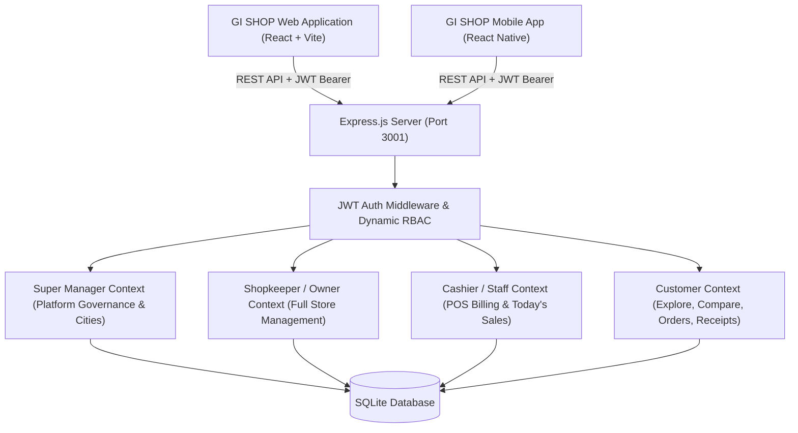

# GI SHOP — System Roles, Permissions & Architecture Specification

**Application Name:** **GI SHOP** (Web & Mobile App)  
**Platforms:** Web (React + Vite) & Mobile (React Native / Expo)  
**Backend:** Node.js + Express (Port 3001) with SQLite Relational DB & JWT Authentication

---

## 1. System Architecture Overview

**GI SHOP** operates on a **zero-trust, role-based client-server architecture**. Whether a user connects via the Web app (`http://localhost:5173`) or the React Native Mobile App (`shop-ledger-mobile/`), they authenticate against the same backend APIs. Every request presents a cryptographically verified JSON Web Token (JWT), and all data access is strictly enforced by dynamic database role and relationship checks.

---

## 2. Role 1: 🛡️ Super Manager (Super Admin)

### 2.1 Identity & Governance Scope
- **Account Identification:** Unique `email` and `phone` with `role: 'SuperManager'`.
- **System Purpose:** Global platform administration, city directory management, and compliance governance.

### 2.2 Core Capabilities ("What Super Admin Can Do")
1. **Platform City Governance (Super Admin Exclusive):**
   - Manage the platform's active cities directory (`Cities` table).
   - Add new cities (e.g. `Delhi`, `Mumbai`, `Bengaluru`, `Chandigarh`, `Patna`, `Surat`).
   - Remove cities from the active platform list.
   - City changes instantly propagate to Customer exploration, Shopkeeper registration, and Price Comparison.
2. **Shop Directory Auditing & Account Controls:**
   - View all registered shops across all cities with revenue metrics and total transaction counts.
   - 1-Click Terminate / Deactivate any shop violating terms.
   - 1-Click Reactivate shops.
3. **User Directory Auditing & Account Controls:**
   - View all registered users (Shopkeepers, Cashiers, Customers) with short IDs, contact info, and status.
   - Terminate or Reactivate user accounts.

### 2.3 Restrictions ("What Super Admin CANNOT Do")
- **Strict Financial Immutability:** Super Managers have **read-only access** to sales totals and analytics. Direct modification, deletion, or tampering with financial receipts, customer debts, or inventory prices is strictly blocked.

---

## 3. Role 2: 🏪 Shopkeeper (Store Owner)

### 3.1 Identity & Scope
- **Account Identification:** Unique `email` and `phone` with `role: 'Shopkeeper'`.
- **Shop Association:** 1-to-1 owner of a registered `Shops` entity. Short ID auto-assigned (e.g. `shp49`).
- **Data Scope:** Full control over their own store's inventory, staff, orders, customer khata, and analytics.

### 3.2 Core Capabilities ("What the Owner Can Do")
1. **High-Speed Point of Sale (POS Billing):**
   - Full access to shop inventory with instant search and smart unit selectors (`Piece`, `Kilo (Default)` / `Gram`, `Litre (Default)` / `Millilitre`).
   - Reverse price calculation (e.g. typing `₹30` on a `₹60/kg` item computes `0.5 kg`).
   - Complete billing with **Cash**, **Online (UPI)**, or **Add to Book (Khata)**.
2. **Inventory Management & Master Grocery Library:**
   - Add, edit, or delete items in the store catalog.
   - Master Grocery Library auto-complete: auto-fills standard names, market rates, and units from 100+ common Indian grocery items (strictly hidden from customers).
3. **Staff & Cashier Management:**
   - Search any customer by Short ID or Phone number.
   - Send invitation to join as a **Cashier**.
   - View active staff and revoke/remove staff access at any time.
4. **Full Financial Analytics & Order Fulfilling:**
   - View transactions across all date ranges (`Today`, `Yesterday`, `7 Days`, `15 Days`, `1 Month`, `3 Months`, `1 Year`, `Custom Range`).
   - Accept customer order requests with packing ETA timer or decline with reason.
   - Add notes (up to 20 characters) to sales receipts.
5. **Shop Details & Availability Controls:**
   - Edit Shop Name, Phone, City, Address, and Timings.
   - Toggle store status (**🟢 Shop is OPEN** / **🔴 Shop is CLOSED**).

### 3.3 Restrictions ("What the Owner CANNOT Do")
- **Historical Sales Immutability:** Cannot change the prices or quantities of previously completed and saved receipts (only optional $\le 20$-character text notes allowed).
- Cannot access data or inventory belonging to any other shop.

---

## 4. Role 3: 💼 Cashier (Shop Staff)

### 4.1 Identity & Scope
- **Account Identification:** Customer account invited and accepted as `Cashier` in `ShopStaff`.
- **System Purpose:** Fast on-counter billing and order fulfillment without managerial overhead.

### 4.2 Core Capabilities ("What the Cashier Can Do")
1. **Full POS Selling & Billing:**
   - View all store items in the POS catalog.
   - Take customer orders, apply weights/volumes, select customer, apply discounts, and complete sales (Cash, Online, Add to Book).
2. **Order Fulfillment:**
   - View and accept incoming customer order requests with packing ETA.
   - Mark packed orders ready/completed.
3. **Shop Status Control:**
   - Toggle store status (**🟢 Shop is OPEN** / **🔴 Shop is CLOSED**).
4. **Daily Sales Access:**
   - View **Today's transactions** and cash/online/khata totals.
5. **Receipt Notes:**
   - Add a short memo note ($\le 20$ characters) to a transaction.

### 4.3 Restrictions ("What the Cashier CANNOT Do")
- ❌ **Cannot see past historical transactions** (limited strictly to Today's sales).
- ❌ **Cannot modify product prices or names**.
- ❌ **Cannot add, edit, or delete inventory items**.
- ❌ **Cannot invite or manage staff members**.
- ❌ **Cannot modify shop details** (Shop details modal is strictly view-only with permission banner).
- ❌ **Cannot change the prices of old sales receipts**.

---

## 5. Role 4: 👤 Customer

### 5.1 Identity & Scope
- **Account Identification:** User with `role: 'Customer'` and unique Short ID (e.g. `ayu32`).
- **Data Scope:** Personal cart, active orders, and itemized receipts from enrolled shops.

### 5.2 Core Capabilities ("What the Customer Can Do")
1. **Explore Shops by City:**
   - Browse open and closed shops in the selected city (cities populated dynamically by Super Admin).
   - View store addresses, contact numbers, and timings.
2. **Price Comparison Engine ("Compare Prices"):**
   - Search any grocery product across all city shops.
   - Compare side-by-side rates with 🏆 Lowest Price badge.
   - 1-Tap `[ + Add ]` or `[ Check More Items ]` to jump directly into the shop's catalog.
3. **Single-Shop Cart & Order Placement ("Make a List"):**
   - Build a grocery list from a chosen shop.
   - Single-shop rule: if adding items from another shop, a clear prompt asks whether to keep existing cart or switch.
   - Floating Cart Banner & Interactive Cart Modal with quantity steppers.
   - Send order request directly to the shopkeeper.
4. **Live Order Tracker & Printable Slip:**
   - Real-time packing countdown and status (`PENDING`, `PACKING ~15m`, `COMPLETED`, `DECLINED`).
   - Click any order to view full shop details and download/print an official digital order slip.
5. **Purchases & Digital Receipts Timeline:**
   - View full lifetime receipts across all stores visited with itemized breakdown.
6. **Accept Staff Invitations:**
   - Receive in-app invitation banners from shopkeepers to join as Cashier with `[ Accept & Join ]` / `[ Decline ]`.

### 5.3 Restrictions ("What the Customer CANNOT Do")
- Cannot view POS billing or other customers' orders/receipts.
- Cannot see the Shopkeeper Master Grocery Library.
- Cannot place orders with shops that are marked CLOSED.
- Cannot place orders if blocked by a shopkeeper.

---

## 6. Role Comparison Matrix

| Feature / Action | 🛡️ Super Manager | 🏪 Shopkeeper (Owner) | 💼 Cashier (Staff) | 👤 Customer |
| :--- | :---: | :---: | :---: | :---: |
| **Manage Platform Cities (Add/Remove)** | ✅ **Super Admin Only** | ❌ | ❌ | ❌ |
| **Audit & Terminate Shops / Users** | ✅ | ❌ | ❌ | ❌ |
| **POS Billing & Selling** | ❌ | ✅ | ✅ | ❌ |
| **View Full Inventory Catalog** | ❌ | ✅ | ✅ | (Shop View Only) |
| **Add / Edit / Delete Inventory Items** | ❌ | ✅ | ❌ | ❌ |
| **Master Grocery Library Auto-Complete**| ❌ | ✅ | ❌ | ❌ |
| **Invite & Manage Staff** | ❌ | ✅ | ❌ | ❌ |
| **Edit Shop Information** | ❌ | ✅ | ❌ (View-Only) | ❌ |
| **Toggle Shop Open / Closed** | ❌ | ✅ | ✅ | ❌ |
| **Full Historical Financial Analytics** | Read-Only Summary | ✅ (All Ranges) | ❌ (Today Only) | ❌ |
| **Add Memo Note to Bill ($\le 20$ chars)**| ❌ | ✅ | ✅ | ❌ |
| **Modify Past Receipt Prices** | ❌ **PROHIBITED** | ❌ **PROHIBITED** | ❌ **PROHIBITED** | ❌ **PROHIBITED** |
| **Compare Prices Across City Shops** | ❌ | ❌ | ❌ | ✅ |
| **Send Order to Shop (Single-Shop Cart)**| ❌ | ❌ | ❌ | ✅ |
| **Download / Print Order Slip** | ❌ | ✅ | ✅ | ✅ |
